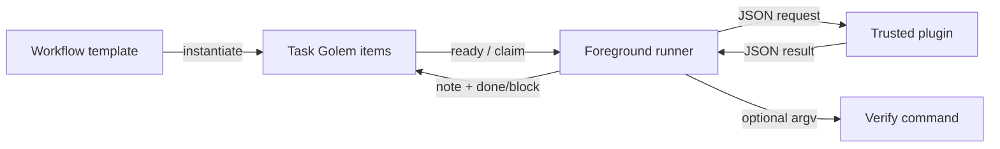

# Design: Template-driven agent runner

**ID:** TG-009
**Status:** Complete
**Created:** 2026-08-13
**PRD:** N/A - `CHANGE.md` is the requirements source
**Mode:** one-shot

## TL;DR

- **Shape:** Templates create TG DAGs; plugins run executable Tasks; a small foreground loop claims, invokes, optionally verifies, and transitions one Task at a time.
- **State:** TG owns all mutable progress. `x-workflow` stores resolved execution configuration and an opaque shared-session reference; notes store concise outcomes.
- **Tradeoff:** V1 trusts plugin results and local plugins. It is an experiment, not a crash-perfect or hostile-code-safe workflow engine.

## Goals & Non-goals

**Goals:**

- Reuse workflow shapes without hard-coding HAMY or another domain into the runner.
- Run arbitrary trusted agent/command adapters through one request/result contract.
- Expose Story/Task progress and dependencies through normal TG items.
- Configure fresh versus shared agent sessions per Task.
- Keep deterministic verification agent-free and optional.

**Non-goals:**

- Independent completion reconciliation or immutable run ledgers.
- Sandboxing, secret isolation, permissions, or untrusted plugins.
- Concurrent workers, daemons, leases, exact-once execution, or cross-machine resume.
- Automatic Git commits, PRs, deployments, or dynamic DAG mutation.
- A first-class review lifecycle; review is an ordinary workflow Task.

## User workflows

### Instantiate

```bash
tg workflow instantiate .task-golem/workflows/hamy-example.yaml \
  --instance WRK-123 \
  --input change_path=changes/WRK-123_example/CHANGE.md
```

The command validates the entire template, resolves node references, inputs, and plugin files, creates all TG items in one locked write, and returns the Campaign ID plus node mapping. Each referenced input must be supplied exactly once as `--input key=value`; missing, extra, or duplicate inputs fail. Substitution replaces only a scalar that is exactly `${key}`. Repeating the same instance returns its active or archived Campaign only when the SHA-256 digest of the canonical resolved template, inputs, and plugin definitions matches; any mismatch fails. The workspace root is always the parent of the discovered `.task-golem` directory, regardless of invocation CWD.

### Run or resume

```bash
tg workflow run <campaign-id>
```

The runner:

1. Finishes any container whose descendant Tasks are done.
2. Resumes the one `doing` Task claimed as `workflow:<campaign-id>` when it has a result or resumable session reference.
3. Otherwise chooses the next scoped ready Task by TG order, claims it, and invokes its plugin.
4. Runs optional verify argv when the plugin reports complete.
5. Appends a concise TG note, stores the returned session reference when applicable, and marks done or blocked.
6. Repeats until the Campaign completes, blocks, or is interrupted. After the runner exits, a blocked Task is retried only after `tg unblock <task-id>` followed by `tg todo <task-id>` resets it to a fresh claimable state.

### Inspect

```bash
tg workflow status <campaign-id> --json
```

Status merges active and archived Campaign items into a versioned object with Campaign identity/rollup plus `current`, `completed`, `blockers`, and `next_ready` arrays. Task entries contain ID, node ID, title, and status; blockers also contain their reason. Human output projects the same fields. It does not create another progress store, and malformed or missing workflow metadata fails rather than producing a partial guess.

## Architecture



## Contracts

### Template v1

```yaml
version: 1
name: hamy-example
plugins:
  writer: .task-golem/plugins/agent.yaml
  reviewer: .task-golem/plugins/reviewer.yaml
nodes:
  - id: campaign
    kind: container
    title: Build WRK-123
  - id: story-1
    kind: container
    parent: campaign
    title: First outcome
  - id: task-1
    kind: task
    parent: story-1
    title: Implement first outcome
    description: Produce the acceptance outcome described in CHANGE.md.
    plugin: writer
    context: shared:story-1
    input:
      change_path: ${change_path}
    verify: ["just", "check"]
  - id: review-1
    kind: task
    parent: story-1
    depends_on: [task-1]
    title: Review first outcome
    plugin: reviewer
    context: fresh
```

Rules:

- Exactly one root container; parent references form a tree; dependencies form an acyclic graph.
- Only Tasks have plugins. Containers exist for hierarchy/rollup and are never dispatched.
- Inputs are unique CLI strings and substitution replaces only a scalar exactly equal to `${name}`; missing, extra, or duplicate inputs fail before any write. There is no interpolation, expression, or shell language.
- `verify` is an argv array executed directly, never through a shell.
- Only Tasks may declare `depends_on`, and every dependency target must be another Task. Workflow authors/adapters flatten Story ordering onto the downstream Story's root Tasks; containers remain hierarchy/rollup only.
- Every container must have at least one executable descendant.
- Template and plugin definition files must canonicalize beneath the workspace root. Plugin and verify argv remain literal and execute directly with the workspace root as `current_dir`.

### Plugin v1

Plugin file:

```yaml
version: 1
argv: ["python3", ".task-golem/plugins/agent.py"]
```

Invocation:

```text
<plugin argv> <absolute-request-json> <absolute-result-json>
```

Request:

```json
{
  "version": 1,
  "campaign_id": "tg-...",
  "task_id": "tg-...",
  "title": "Implement first outcome",
  "description": "...",
  "workspace": "/absolute/repo",
  "input": {},
  "context": {
    "mode": "fresh|shared|none",
    "key": "story-1",
    "session_ref": "opaque-or-null",
    "resume": false
  }
}
```

Result:

```json
{
  "version": 1,
  "status": "complete|blocked",
  "summary": "Concise result or blocker",
  "session_ref": "opaque-or-null"
}
```

Rules:

- The plugin is trusted local code and may launch an agent, run a command, or coordinate review/repair internally.
- Workflow inputs and result summaries are public repository data. Plugins obtain credentials from process-local environment or provider configuration and never copy secrets into request/result files, summaries, metadata, or notes.
- The plugin writes the result atomically. Exit zero plus valid `complete` is success; every other outcome blocks unless an existing valid result can be ingested.
- `fresh` receives no session reference and does not persist one. `shared` receives and may replace the owning container's reference. `none` must return no reference.
- `shared:<node>` must reference an ancestor container; all Tasks sharing that container must use the same plugin. V1 supports one shared session per container.
- Output is not proof. V1 accepts it because testing usefulness precedes hardening; optional verify is the only independent check.

### TG projection

Every instantiated item receives one `x-workflow` object:

```json
{
  "version": 1,
  "instance": "WRK-123",
  "node": "task-1",
  "kind": "task",
  "plugin": {"version": 1, "argv": ["python3", "..."]},
  "context": {"mode": "shared", "key": "story-1"},
  "input": {},
  "verify": ["just", "check"],
  "instance_digest": "sha256:<canonical-resolved-template-input-plugin-digest>"
}
```

The template is not needed after instantiation; resolved execution configuration travels with the TG item. A container using shared context additionally stores `x-workflow.session_ref`; Tasks never duplicate it. Runtime writes only status/claim, concise notes, and that container-owned session reference.

## Runner behavior

### Selection

- One process and Campaign at a time; no daemon.
- Scope candidates to descendants of the selected Campaign and `x-workflow.kind=task`.
- Hold an OS advisory lock at `.task-golem/workflow-results/<campaign-id>.lock` for the lifetime of `tg workflow run`; failure to acquire it rejects a second local runner before selection. This lock is not TG progress state or a lease.
- Use stable claim `workflow:<campaign-id>`. Prefer one Task in `doing` with that claim for resume; any other or multiple doing Tasks block as ambiguous.
- Otherwise use TG ready ordering and add item ID as the final tie-breaker.
- Claim, then re-read and confirm scope/dependencies before launch.
- Concurrent `tg workflow run` processes for one Campaign are unsupported; the Campaign process lock rejects the second process.
- Hold `tasks.lock` only for claim or transition read-modify-write. Release it before launching the plugin or verify command, then reacquire and re-read the claimed Task before applying the result.

### Completion

- `complete` without verify: note and `tg done`.
- `complete` with passing verify: note command/exit and `tg done`.
- Plugin block/error/malformed result: note and `tg block`.
- Verify failure: note bounded output and `tg block`; no automatic repair loop in v1.
- UTF-8 truncate public summary and diagnostics until the complete serialized note event fits the 2,048-byte Store limit; if no detail fits, retain only status and exit metadata.
- After a Task completes, repeatedly close containers whose descendants are all archived done.
- Requests/results live under ignored `.task-golem/workflow-results/<task-id>/`. Ingest an existing valid result only while resuming an already-`doing` Task; delete stale IPC files before launching a newly claimed `todo` Task, including one explicitly reset through `tg unblock` then `tg todo` after a block.
- Resolve every repository-local plugin/result path against workspace root and run plugin plus verify argv with workspace root as `current_dir`.

### Interruption

- SIGINT/SIGTERM best-effort terminates the child process and leaves the Task `doing`.
- A result file written before interruption is ingested on restart.
- A shared Task with a stored session reference is reinvoked with `resume=true`.
- A Task with neither result nor resumable session is blocked as `interrupted-without-resume-state`; the runner never blindly replays it.
- `tg unblock` restores a plugin-blocked Task to unclaimed `doing`, which is intentionally not resumable. With the runner stopped, the documented retry path is `tg unblock <task-id>`, `tg todo <task-id>`, then `tg workflow run`.

### Shared Story writer

- The referenced ancestor container stores the one opaque `session_ref` for its shared key.
- Coding and repair Tasks in the HAMY-shaped fixture use the same Story key serially.
- Review Tasks use `fresh` and cannot receive the writer's session reference.
- Closing a Story clears no provider data; retention/cleanup is plugin-owned and deferred.

## Implementation shape

- `src/workflow.rs` plus `src/workflow/template.rs`: template/plugin parsing and validation.
- `src/workflow/instantiate.rs`: idempotent batch creation.
- `src/workflow/runner.rs`: Campaign process lock, selection, plugin invocation, verification, transitions, and resume.
- `src/workflow/status.rs`: active/archive projection.
- `src/cli/commands/workflow.rs`: `instantiate`, `run`, and `status` routing.
- Managed `.task-golem/.gitignore`: add `workflow-results/` through init/doctor; templates, plugins, and TG item state remain visible project files.

Keep decision logic in pure functions and filesystem/process/TG effects at the command edge. Reuse current Store locking, dependency calculation, transitions, events, and test fixtures rather than adding another persistence layer.

## Verification

- Unit: template parser, variable substitution, graph validation, result parsing, context routing, selection, and container rollup.
- Integration: real temporary TG store plus fake plugins for success, block, malformed result, verify failure, shared/fresh context, interruption, stale-result cleanup, nested invocation CWD, short lock scope, and idempotent instantiate with matching/mismatched inputs.
- E2E: instantiate and drain the HAMY-shaped fixture; then add a second template/plugin without runner changes.

## Alternatives considered

- **HAMY-only runner:** faster first integration but does not test reusable templates/plugins.
- **Durable orchestration platform:** stronger recovery and trust but too much investment before usefulness is known.
- **Thin template/plugin runner, chosen:** enough structure to test the idea while leaving hardening proportional to observed failures.
